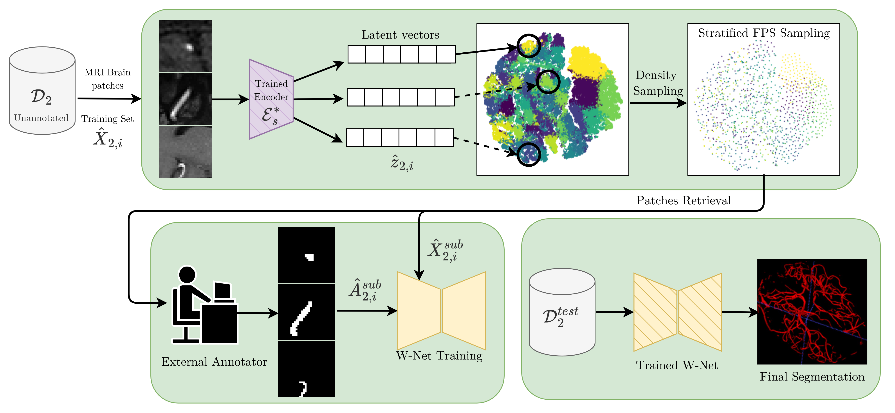

# V-DiSNet
One-shot Active Learning for brain vessel segmentation




This is the implementation of the V-DiSNet framework for vessel brain MRI segmentation in **Pytorch**.

## Open Datasets

### IXI

- Download the dataset (MR Images + Corresponding annotated brain and vessels masks) from the official IXI [webpage](https://brain-development.org/ixi-dataset).
- Expected folder organization:

    ```bash
    .
    └── IXI/
        ├── volumes/
        │   ├── IXI002-Guys-0828-MRA.nii.gz
        │   ├── IXI012-HH-1211-MRA.nii.gz
        │   └── ...
        ├── masks/
        │   ├── IXI002-Guys-0828-MRA_mask.nii.gz
        │   ├── IXI012-HH-1211-MRA_mask.nii.gz
        │   └── ...
        └── vessels/
            ├── IXI002-Guys-0828-MRA_vessel_mask2.nii.gz
            └── IXI012-HH-1211-MRA_vessel_mask2.nii.gz
            └── ...
    ```

### CAS

- Download the dataset (MR Images + Corresponding vessels masks) from the following [link](https://codalab.lisn.upsaclay.fr/competitions/9804).
- Download the [A2V](linktoA2V.it)-generated brain masks from the following [link](linktoA2V.it) or generate by using other softwares (e.g. [FreeSurfer](https://surfer.nmr.mgh.harvard.edu/) or [HDBET](https://github.com/MIC-DKFZ/HD-BET))
- Expected folder organization:

    ```bash
    .
    └── CAS/
        ├── volumes/
        │   ├── 000.nii.gz
        │   ├── 001.nii.gz
        │   └── ...
        ├── masks/
        │   ├── pred_000.nii.gz
        │   ├── pred_001.nii.gz
        │   └── ...
        └── vessels/
            ├── vessels_001.nii.gz
            ├── vessels_001.nii.gz
            └── ...
    ```

    


## Preprocessing - Step 1
    
- Run the preprocessing notebooks for both the IXI and CAS dataset:

    ```bash
    .
    └── preprocessings
        ├── preprocessing_IXI.ipynb
        └── preprocessing_CAS.ipynb
    ```
- Adjust the corresponding input and output path in the first section (*Prepare dataset*)

## Preprocessing - Step 2
    
- Run the preprocessing file *load_patches* for both the IXI and CAS dataset to split each volume into patches:

    ```bash
    python patch_dataloader/load_patches.py --dataset IXIJ
    python patch_dataloader/load_patches.py --dataset CASJ
    ```
- Adjust the corresponding input and output paths and parameters values(size of patch, standardization, etc.) at the end of the file.


## Dictionary Learning - Binary Vessel Latent space extraction
    
- Run the dictionary learning module to train an encoder to generate latent representations of binary vessel patches from IXI:

    ```bash
    python script_py/VPATCHES_SDL.py
    
                 (../VPATCHES_SDL-NL.py)
                 (../VPATCHES_VDL.py)
                 (../VPATCHES_VDL-NL.py)
    ```
- Adjust the parameters values(batch_size, epochs, etc.).
- You can also run different variation of the Dictionary Learning Model (Non linear decoder (NL), Variance-regularized (VDL)).
- Results of this step are saved by default in the folder *~/results/*
## Contrastive Learning - Vessel Patches Latent space extraction
    
- Run the following notebook: 

    ```bash
    .
    └── get_embedding_DL
        └── COMPLETE_PIPELINE_FINALE.ipynb
         
    ```
- Adjust, if needed, to input and output paths in the section *1 - Load Data*
- Modify the datetime of section *2 - Create Embeddings* to load the best dictionary learning model (trained in the previous step)

#### Steps of the *COMPLETE_PIPELINE_FINALE* Notebook

###### Part 1: Dictionary Learning
- Load IXI dataset and the best encoder from the previous step.
- Extract the latent representation for the binary vessel patches.
- Compute PSNR and save the vessel dictionary.
- Visualize the latent space in 2D using T-SNE.
- Find clusters by using k-means on the latent representations 

###### Part 2: Contrastive Learning:
- Train a contrastive learning model by using patches from IXI as input and previous k-means classes as label
- This allows to generate a latent space where similar brain patches are close to each other based on the vessels present in the patch.
- Extract the encoder from the contrastive model and use it to generate a latent space of patches from the non-annotated dataset CAS.
- Find clusters by using k-means on the latent representations. 

## One-shot Active Learning
    
- Run the one-shot active learning file *FINAL_EXPERIMENT* to sample different percentages of CAS patches (to be annotated by an external oracle) and use the selected annotated patches to train a segmentation model (WNET):

    ```bash
    python get_embedding_DL/FINAL_EXPERIMENT.py
         
    ```
- By default, this python file runs all the experiments present in the paper, all the 3 baselines (R-C, FT-C, FL-C), the random and the complete dataset baselines for 8 different seeds.


